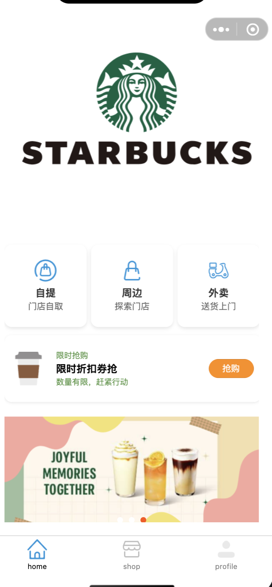
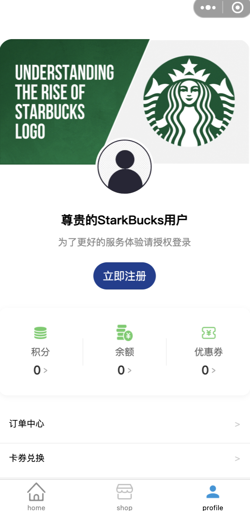

# CoffeeShop
咖啡点单小程序前端页面

基于微信开发者程序工具搭建的微信小程序应用

页面朝参考 星巴克，小奇迹等主流咖啡的小程序页面

## 项目结构

.
├── README.md
├── miniprogram
│   ├── app.json
│   ├── app.ts
│   ├── app.wxss
│   ├── assets
│   ├── components
│   ├── pages
│   └── utils
├── package.json
├── project.config.json
├── project.private.config.json
├── tsconfig.json
└── typings
    ├── index.d.ts
    └── types

## 项目运行

配合微信开发者工具运行

## 项目截图

